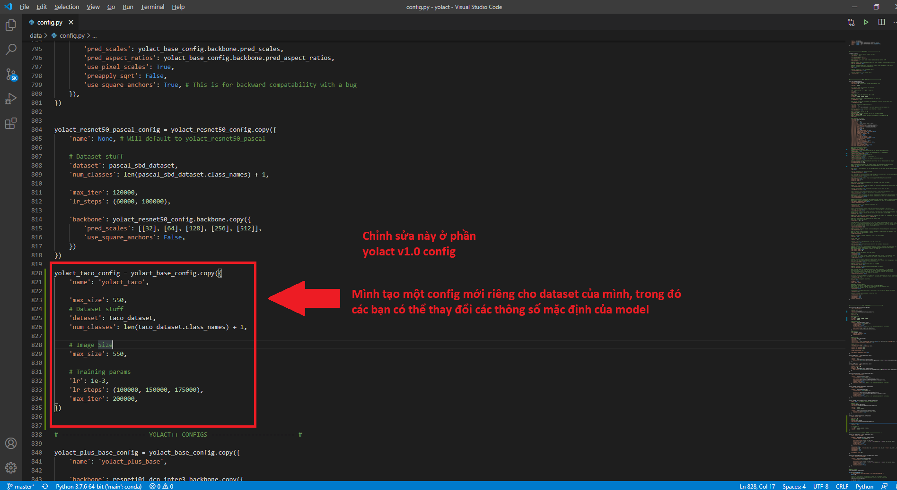
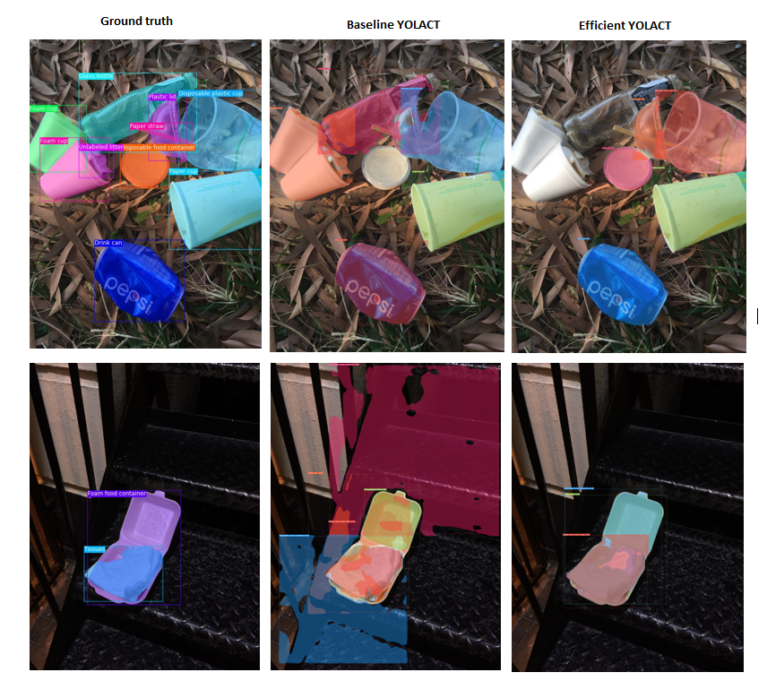

# Real-Time Trash Instaces Segmentation
 Project for studying

## **Introduction**

- Cấu trúc của Yolact (ảnh lấy từ paper)

- Yolact quan trọng vấn đề tốc độ hơn chính xác (độ chính xác giảm không nhiều, nhưng tốc độ vượt trội hơn so với các model khác)

## **Referenced Papers:** 

1. **YOLACT: Real-time Instance Segmentation**
    - Author: Daniel Bolya
    - Cited by 45
    - Link: https://arxiv.org/abs/1904.02689

2.	**YOLACT++: Better Real-time Instance Segmentation (2019)**
    -	Author: Daniel Bolya
    -	Cited by 2
    -	Link: https://arxiv.org/abs/1912.06218

## **Datasets:**
  -	TACO (Trash Annotations in Context)	: https://github.com/pedropro/TACO
  -	COCO 					: https://cocodataset.org/#download
  
## **Pretrained Weights**
	
Model | Image Size | Backbone | Dataset | Weights
--- | --- | --- | --- | --- 
YOLACT | 550 x 550 | Resnet101-FPN | COCO | [yolact_base_54_800000.pth](https://drive.google.com/file/d/1UYy3dMapbH1BnmtZU4WH1zbYgOzzHHf_/view)
YOLACT | 550 x 550 | Resnet101-FPN | TACO | [yolact_base_10_16500.pth](https://drive.google.com/file/d/1XuCem1VaEv4X_IZr1ccgBwoJ_pWM8yRE/view?usp=sharing)

Backbone Resnet101: [Link](https://drive.google.com/file/d/1tvqFPd4bJtakOlmn-uIA492g2qurRChj/view?usp=sharing)

## **Referenced Codes:**
  -	Yolact: https://github.com/dbolya/yolact

## **Guide Video:**
- **COCO Annotation Format Guide**

	
# **Hướng dẫn cài đặt và sử dụng trên colab**
- Vào link này, thêm lối tắt drive của dataset và annotiation về drive của mình: 
	- [Link dataset và annotation của TACO](https://drive.google.com/file/d/1Ol3OcfjAfRul0lxKuV6ezaKP89HXqDMz/view?usp=sharing)
- Thêm lối tắt 3 file pretrained weights ở trên về drive của mình

- Tải [file colab](https://colab.research.google.com/drive/1ZVlF6K5HfcsS_G1tW_esY542n80CZOn0?usp=sharing) và chạy thử

# **Hướng dẫn thêm dataset mới**
- Đầu tiên clone source code của Yolact từ trang [github](https://github.com/dbolya/yolact) của họ về
- Vào thư mục yolact/data mở file config.py và làm giống như ví dụ dưới đây

- Sau đó bạn push folder yolact đó lên github cá nhân, và cũng upload dataset mới lên drive cá nhân
- Tham khảo colab của mình, thay vào đó link github và drive của bạn

# **Report**

- Paper: [Read more here](https://github.com/kaylode/trash-segmentation/blob/master/report/Efficient%20Network%20For%20Applying%20Trash%20Segmentationinto%20Real%20Life.pdf)

